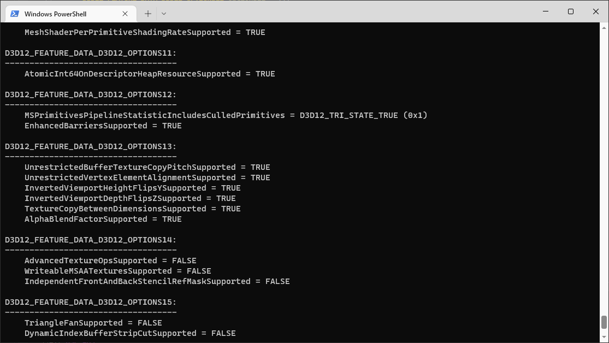

# D3d12info

A Windows console program that gets all the information about the GPU (graphics chip) installed in the system, through DXGI and Direct3D 12 (D3D12) + AMD AGS, NVAPI, WinAPI, and some other sources.



Inspired by `vulkaninfo` - a similar tool that prints all the information about device capabilities using Vulkan API.

An alternative for D3D12 is a GUI program "DirectX Caps Viewer", which is part of Windows SDK and can be found in path like:
`c:\Program Files (x86)\Windows Kits\10\bin\*\x64\dxcapsviewer.exe`.

# GUI and online database

- Online database of GPU capabilities:
  - **https://d3d12infodb.boolka.dev/**
- GUI application that can display the capabilities of the current GPU and submit them to the database:
  - **https://github.com/Devaniti/D3d12infoGUI/releases**

*(These projects are managed by [\@Devaniti](https://github.com/Devaniti))*

# Download

To download an archive with compiled binary of this console app, go to **[Releases](https://github.com/sawickiap/D3d12info/releases)**. This is a portable program - it doesn't need installation.

Version history can be found in file [CHANGELOG.md](CHANGELOG.md).

# Command-line syntax

```
Options:
  -v --Version                     Only print program version information.
  -h --Help                        Only print this help (command line syntax).
  -l --List                        Only print the list of all adapters.
  -a --Adapter=<Index>             Print details of adapter at specified index.
  --AllNonSoftware                 Print details of all (except WARP and Software) adapters (default behavior).
  --AllAdapters                    Print details of all (except WARP) adapters.
  -j --JSON                        Print output in JSON format instead of human-friendly text.
  -f --Formats                     Include information about DXGI format capabilities.
  -e --Enums                       Include information about all known enums and their values.
  --PureD3D12                      Extract information only from D3D12 and no other sources.
  -x --EnableExperimental=<on/off> Whether to enable experimental features before querying device capabilities. Default is off for D3d12info and on for D3d12info_preview.
  --ForceVendorAPI                 Tries to query info via vendor-specific APIs, even in case when vendor doesn't match.
  --WARP                           Use WARP adapter.
```

# License

The project is open source under MIT license. See file [LICENSE.txt](LICENSE.txt).

# Building

The project uses Cmake. It is intended to be built using Microsoft Visual Studio 2022.
Before trying to build make sure to initialize sumbodules as they have required dependencies.
The source code depends on:

- C++ standard library, including some of the latest C++20 features
- WinAPI from Windows 10 with some reasonably new Windows SDK, including Direct3D 12

It uses following thirt-party libraries:

- **[DirectX 12 Agility SDK](https://devblogs.microsoft.com/directx/directx12agility/)** - latest API to Direct3D, by Microsoft.
  - Embedded in directory: Src\ThirdParty\microsoft.direct3d.d3d12.*
- **[RapidJSON](https://rapidjson.org/)** - a fast JSON parser/generator, by Tencent. License: MIT.
  - Linked via submodule.
- **[AMD GPU Services](https://github.com/GPUOpen-LibrariesAndSDKs/AGS_SDK)** - custom vendor extensions to graphics APIs by AMD.
  - Linked via submodule.
  - Optional, controlled by Cmake variable `ENABLE_AGS` - on by default.
- **[NVAPI](https://developer.nvidia.com/nvapi)** - custom vendor extensions to graphics APIs by Nvidia.
  - Linked via submodule.
  - Optional, controlled by Cmake variable `ENABLE_NVAPI` - on by default.
- **[Intel GPU Detect](https://github.com/GameTechDev/gpudetect)** - custom vendor extensions to graphics APIs by Intel. License: Apache 2.0.
  - Linked via submodule.
  - Optional, controlled by Cmake variable `ENABLE_INTEL_GPUDETECT` - on by default.
- **[Vulkan SDK](https://www.lunarg.com/vulkan-sdk/)**
  - Linked externally. Cmake automatically detects Vulkan SDK path.
  - Optional, controlled by Cmake variable `ENABLE_VULKAN` - on by default.
